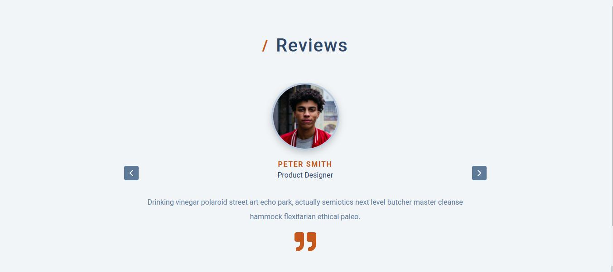

# Image Slider 

> This is a react application used as a practice to become better in react.
> The images in the data.js slides from one index to another as the index of the each objects of the array changes when the user clicks on either of the right or left arrow on the app. JavaScript setInterval method also used to automatically slides at every 3 seconds to make the app interesting to beholding.



## ⚒️  Built with

- Html
- Css
- JavaScript
- React

## 🎞️ Frameworks and Technologies used

- HTML
- CSS
- JavaScript
- ReactJS

## 🖥️ Live Demo
- [Netlify](https://qoosim-image-slider.netlify.app/) :point_left:

## Getting Started

To get a local copy up and running on your machine, follow these simple steps.
Enter this in your terminal 👇 
``` 
  git clone https://github.com/Qoosim/image-slider-react.git 
``` 
## 🛠️ Prerequisites
```
  Install Node.js on your machine
```
## 🕹️ Setup
```
  Clone the repository on your machine and cd into it
  run npm install
  run npm run start
```
## Author

👤 **Qoosim AbdulGhaniyy**

- GitHub: [Qoosim](https://github.com/Qoosim)
- LinkedIn: [Qoosim](https://www.linkedin.com/in/qoosim)

## 🤝 Contributing

Contributions, issues, and feature requests are welcome!

Feel free to check the [issues page](../../issues/).

## Show your support

Give a ⭐️ if you like this project!

## Acknowledgments

- To those assist in understanding the concept of React 

## 📝 License

This project is [MIT](./MIT.md) licensed.
